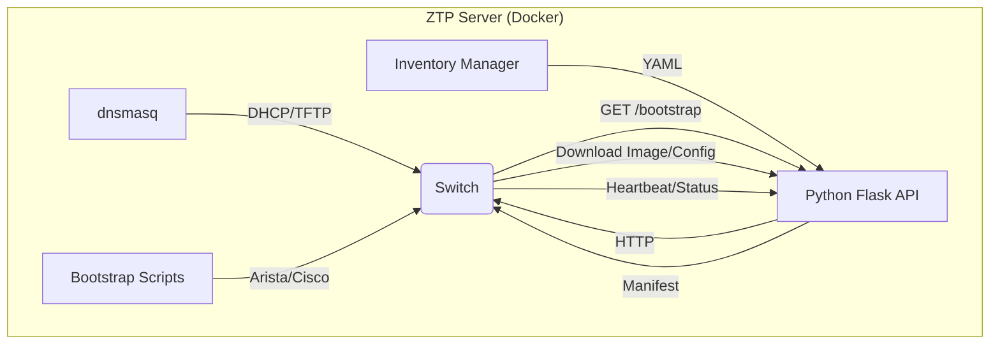

# Multi-Vendor ZTP Server

A lightweight, Dockerized Zero Touch Provisioning (ZTP) server designed for Arista (EOS) and Cisco (IOS-XE) switches. This server automates the deployment process by serving firmware and configurations based on device serial numbers and provisioning priorities.

## Features

- **Multi-Vendor Support**: Unified bootstrap mechanism for Arista and Cisco devices.
- **Priority-Based Provisioning**: Control the order in which switches are provisioned (e.g., core switches first, then edge).
- **Parallel Deployment**: Switches within the same priority level are provisioned simultaneously.
- **Live Progress Dashboard**: Real-time monitoring of the ZTP process directly from your terminal.
- **Dynamic Inventory**: Hot-reload inventory changes without restarting the server.
- **Air-Gapped Ready**: Completely self-contained, serving all necessary files locally.

## High-Level Architecture



## Quick Start

1.  **Clone the repository**:
    ```bash
    git clone <repository-url>
    cd arista-ztp
    ```

2.  **Configure the environment and inventory**:
    These three files hold real serials, IPs and password hashes, so they are
    gitignored — copy the templates and edit your own copies. Every
    `CHANGE_ME_…` / `REPLACE_ME__…` value has to be replaced; the config
    generator refuses to run while any credential placeholder is left.
    ```bash
    cp .env.example                     .env
    cp config/inventory.yaml.template   config/inventory.yaml
    cp config/config.yaml.template      config/config.yaml

    openssl passwd -6                   # Arista hashes for config/config.yaml
    ```

3.  **Add Firmware & Configs**:
    Place your firmware images in `firmware/`. `configs/` starts empty: its
    `.cfg` files — including `generic.cfg`, the fallback served to switches
    that are not in the inventory — are produced by the configuration
    generator below, once the password placeholders are replaced. They hold
    credential hashes, so they are gitignored. `./start.sh start` warns if the
    fallback is still missing.

    **Publish a checksum for every image** — the bootstrap script verifies the
    download against it and refuses a corrupt image. Without one it only logs a
    warning and continues:
    ```bash
    cd firmware
    md5sum EOS64-4.35.5M.swi > EOS64-4.35.5M.swi.md5
    cd ..
    ./check_firmware_hashes.sh      # verify every image against its checksum
    ```

4.  **Launch the Server**:
    ```bash
    chmod +x start.sh
    ./start.sh start
    ```

5.  **Monitor Progress**:
    ```bash
    ./start.sh watch
    ```

## Host-side tooling

The server itself runs in Docker and needs nothing installed locally. The helper
scripts (`generate_generic_config.py`, `scripts/ztp_cli.py`,
`scripts/backup_switches.py`, `scripts/deploy_config.py`) run on the host:

```bash
python3 -m venv venv && . venv/bin/activate
pip install -r requirements.txt
```

## Configuration Generator

To automatically generate `.cfg` configuration files for all switches defined in your inventory, use the configuration generator script. It reads your `config/inventory.yaml` and global settings in `config/config.yaml` to dynamically produce Arista and Cisco templates.

```bash
./generate_generic_config.py
# or
python3 generate_generic_config.py
```

It exits non-zero and names the switch if a config could not be rendered, and
also if `config/config.yaml` or `config/inventory.yaml` is missing entirely.

**Set real password hashes first.** A freshly copied `config/config.yaml` still
has `REPLACE_ME__…` placeholders, and the generator refuses to render any switch
that would receive one — naming the switch and the variable. This matters most
on Cisco: IOS does not reject an unrecognised hash, it treats it as a *cleartext*
password, so a placeholder would become a working privilege-15 login.

Platform and template are kept in sync automatically: a `cisco_ios` switch is
rendered with `cisco_config.j2` even though `config/config.yaml` names
`arista_config.j2` globally, and addresses written in CIDR form in the
inventory are converted to the `ip address <addr> <mask>` syntax IOS expects.

### Per-customer config sets (optional)

A switch's `customer:` field — or `defaults.customer` for the whole inventory —
selects **both** the variable file and the template, by naming convention:

| `customer` | variables | template (eos / eos64) | template (cisco_ios) |
|---|---|---|---|
| *(unset)* | `config/config.yaml`         | `arista_config.j2`                | `cisco_config.j2` |
| `acme`    | `config/config_acme.yaml`    | `arista_config_template_acme.j2`  | `cisco_config_template_acme.j2` |

```yaml
  - serial: ABC1234567
    hostname: "ACME-SW110"
    platform: eos
    customer: acme
    tags: [SITE1]        # a site-keyed vars file selects the block by tag
```

A switch with a `customer` never falls back to `config/config.yaml` or to the
default templates: if the customer's variable file or template is missing, the
generator reports it and skips that switch. `configs/generic.cfg` — the fallback
served to switches that are *not* in the inventory — deliberately stays on the
default set.

A per-switch `vars_file:` or `template:` still overrides the convention — but a
`template:` must belong to the switch's own platform family. An Arista template
on a `cisco_ios` switch is rejected whoever asked for it, including the global
`template:` in `config/config.yaml`, which is simply ignored for Cisco switches.

A `cisco_ios` switch also needs `cisco_admin_password_hash` (and
`cisco_custom_user_password_hash` when `custom_username` is set) in its variable
file. The `$6$` hashes used for Arista are not rejected by IOS — it treats them
as a cleartext password — so the generator refuses to render the config until
IOS-format hashes are provided.

> The TUBITAK deployment used to live here as `customer: tubitak`. It is now a
> separate project: `../tubitak-ztp-server`.

## Management Commands

The `./start.sh` script is the primary interface for managing the ZTP server:

-   `./start.sh start`: Start the server (builds image if needed).
-   `./start.sh restart`: Full rebuild and restart.
-   `./start.sh status`: Show container and service health.
-   `./start.sh logs`: Follow container logs.
-   `./start.sh reload`: Hot-reload inventory changes.
-   `./start.sh reset [SERIAL]`: Forget ZTP completion state so a switch (or the
    whole rollout) provisions again.
-   `./start.sh switches`: List registered switches.
-   `./start.sh priority`: Provisioning order, per priority group.
-   `./start.sh events`: Recent ZTP events.
-   `./start.sh watch`: Live progress dashboard.

All of them talk to `HTTP_PORT` from `.env`.

## Provisioning order

Switches are released in ascending `priority`; equal priorities provision in
parallel. A switch that never boots does **not** block the rollout forever: a
waiting switch is released after `PRIORITY_WAIT_TIMEOUT` seconds (`.env`,
default 1800) and the release is logged as `[PRIORITY-TIMEOUT]`.

Completion state is written to `logs/ztp_state.json`, so restarting the
container mid-rollout does not re-run switches that already finished. That also
means a switch stays "done" across reboots — to provision one again (RMA, lab
re-run) clear its state first:

```bash
./start.sh reset HBG25500VQC   # one switch
./start.sh reset               # the whole rollout (asks for confirmation)
```

Both vendors obey the gate: the Arista bootstrap and the Cisco AutoInstall/EEM
Tcl script each poll `/api/manifest/<serial>` and only start once it answers
200.

A switch that aborts still reports `ztp_complete` — so the queue behind it moves
on — but is shown as `✗ FAILED` in `status`, `priority` and `watch`, never as a
green success. That report is retried until the server confirms it, for
failures exactly as for successes.

A switch already booted from the image its inventory entry asks for skips the
download and install entirely, instead of re-flashing the same version and
holding up everything queued behind it.

For more details on deployment and advanced configuration, see [DEPLOY.md](DEPLOY.md).
